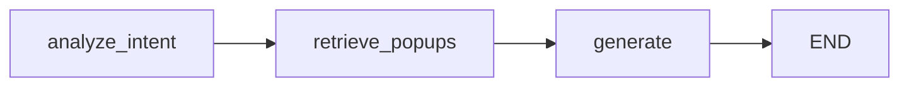

# LangGraph 파이프라인 (popcorn-fastapi-server)

이 문서는 `graph.py`에 정의된 LangGraph 워크플로와, **LLM이 쓰이는 위치**, **각 노드가 `AgentState`에서 무엇을 읽고 무엇을 반환해 다음 노드로 어떻게 이어지는지**를 정리합니다.

---

## 1. 진입점 (FastAPI → 임베딩 API → LangGraph)

`fast.py`의 `POST /recommend`에서 그래프를 호출할 때 넘기는 값은 다음과 같습니다.

| 키 | 출처 | 설명 |
|----|------|------|
| `user_query` | `SpringRequest.question` | 사용자 질문 텍스트 |
| `query_vector` | `SpringRequest.queryVector` **또는** `embedding_client.fetch_query_embedding(question)` | 클라이언트가 벡터를 주면 그대로 사용, 없으면 클라우드 `EMBED_API_BASE_URL` + `EMBED_API_PATH` 로 `{"text": question}` POST 후 응답의 `embedding` 사용 |

체크포인터용 설정:

```text
config = { "configurable": { "thread_id": request.userId } }
```

동일 `userId`로 호출하면 **메모리 체크포인터(`MemorySaver`)** 가 같은 스레드의 상태를 이어 받을 수 있습니다. (특히 `history` 갱신에 영향)

---

## 2. 공통 상태: `AgentState`

`AgentState`는 그래프 전체가 공유하는 상태 객체입니다. (`typing.TypedDict`)

| 필드 | 타입 | 의미 |
|------|------|------|
| `user_query` | `str` | 사용자 질문 |
| `query_vector` | `List[float]` | pgvector 검색용 임베딩 |
| `intent` | `str` | 의도 라벨 (현재 노드 1에서 고정값) |
| `retrieved_popups` | `List[dict]` | DB RAG 결과 (최대 3건) |
| `history` | `List[str]` | 멀티턴 대화 요약용 문자열 목록 |
| `final_answer` | `str` | LLM이 생성한 최종 답변 |

**LangGraph에서 노드 간 전달 방식**

- 각 노드 함수는 **`state: AgentState` 전체**를 인자로 받습니다.
- 반환값은 **`dict`**이며, **반환한 키만 상태에 반영(병합)** 됩니다. (다른 키는 이전 실행의 값이 유지됩니다.)
- 첫 `invoke` 시 API에서 넘긴 `user_query`, `query_vector`만 채워진 상태로 시작하고, 노드가 실행될 때마다 위 규칙으로 필드가 갱신됩니다.

---

## 3. 그래프 토폴로지

```text
analyze_intent → retrieve_popups → generate → END
```

- 조건부 엣지 없음 (항상 위 순서).



---

## 4. 노드별: 읽는 state / 쓰는 state / LLM 여부

### 4.1 `analyze_intent`

| 구분 | 내용 |
|------|------|
| **LLM 사용** | 없음 |
| **주로 읽는 필드** | 없음 (현재 구현은 `state` 내용을 사용하지 않음) |
| **반환 (`dict`)** | `{"intent": "popup_search"}` |
| **다음 노드로 넘어가는 상태** | 기존 `user_query`, `query_vector` 유지 + `intent`만 설정 |

---

### 4.2 `retrieve_popups`

| 구분 | 내용 |
|------|------|
| **LLM 사용** | 없음 (PostgreSQL + pgvector) |
| **읽는 필드** | `state.get("query_vector")` |
| **반환** | 성공/실패 시 모두 `{"retrieved_popups": list}` 형태. 벡터 없음·DB 오류 시 `[]`. |
| **DB 결과 dict 키** | `id`, `name`, `desc`, `lat`, `lon` (쿼리의 `title`→`name`, `description`→`desc`) |
| **다음 노드로** | `retrieved_popups`가 채워지고, 나머지 필드는 이전과 동일 |

---

### 4.3 `generate` (`generate_recommendation`)

| 구분 | 내용 |
|------|------|
| **LLM 사용** | **있음** — 모듈 전역 `llm` (`llama_cpp.Llama`, Qwen2 instruct GGUF) |
| **읽는 필드** | `state["user_query"]`, `state.get("retrieved_popups", [])`, `state.get("history") or []` |
| **LLM 호출** | `llm(prompt, max_tokens=512, stop=["<|im_end|>"], echo=False)` — ChatML 형식 프롬프트 문자열 구성 |
| **반환** | `{"final_answer": answer, "history": new_history}` |
| **`history` 갱신** | `history + [f"User: {query}", f"AI: {answer}"]` (전체 교체가 아니라 **기존 리스트에 두 줄 추가한 새 리스트**를 반환) |

**다음 노드로**

- `generate` 다음은 `END`이므로 별도 노드는 없고, `invoke` 결과로 최종 `AgentState`가 반환됩니다.

---

## 5. LLM이 관여하는 지점 요약

| 위치 | 역할 |
|------|------|
| `graph.py` 상단 | `Llama(...)` 로 모델 로드 (import/앱 기동 시 1회) |
| `generate_recommendation` | 검색된 팝업 텍스트 + 최근 `history` + 사용자 질문을 프롬프트에 넣어 **답변 문장 생성** |

`analyze_intent`, `retrieve_popups`에서는 **LLM을 호출하지 않습니다.**

---

## 6. `invoke` 이후 API 응답 (`fast.py`)

최종 상태에서 다음만 클라이언트에 노출됩니다.

- `answer` ← `result["final_answer"]`
- `retrieved_popups` ← `result["retrieved_popups"]`

`intent`, `history`, `query_vector` 등은 HTTP 응답에는 포함되지 않습니다. (`history`는 같은 `thread_id`로 재호출 시 다음 턴의 `generate`에서 사용됩니다.)

---

## 7. 컴파일된 그래프 객체

```text
workflow.compile(checkpointer=memory)
```

- `memory`: `MemorySaver()` — 프로세스 메모리 기반 체크포인트 (서버 재시작 시 유지되지 않음).

---

## 8. 관련 파일

| 파일 | 역할 |
|------|------|
| `graph.py` | `AgentState`, 노드 3개, `app = workflow.compile(...)` |
| `embedding_client.py` | 클라우드 임베딩 API 호출 (`fetch_query_embedding`) |
| `fast.py` | 임베딩(선택) → `langgraph_app.invoke(inputs, config=...)` |
